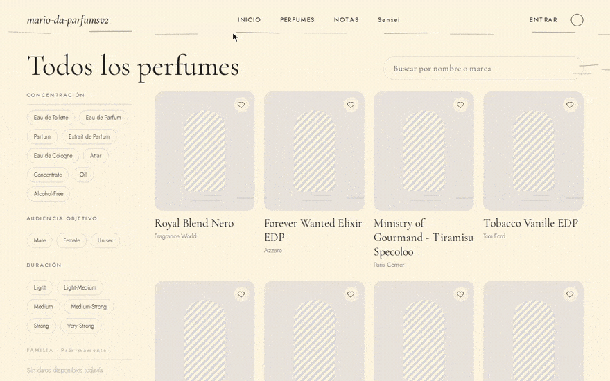
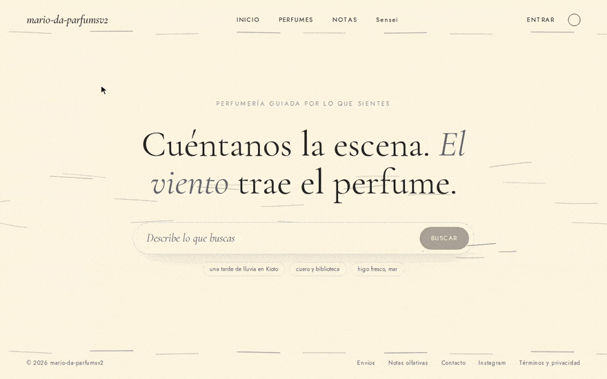
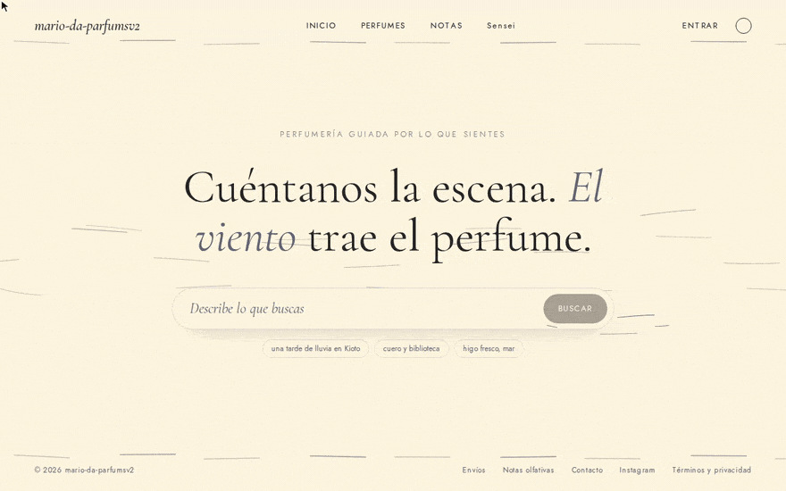
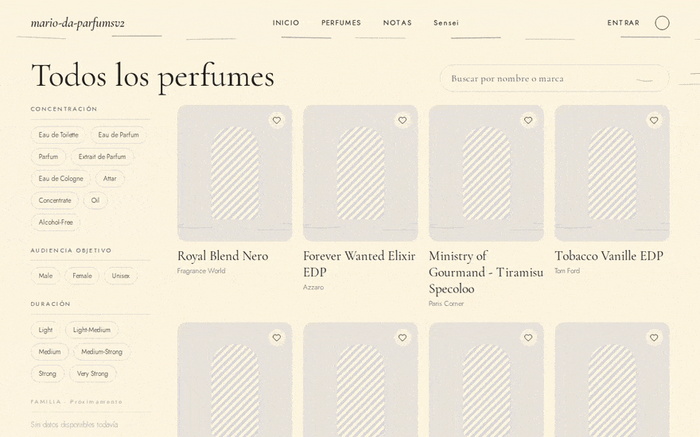
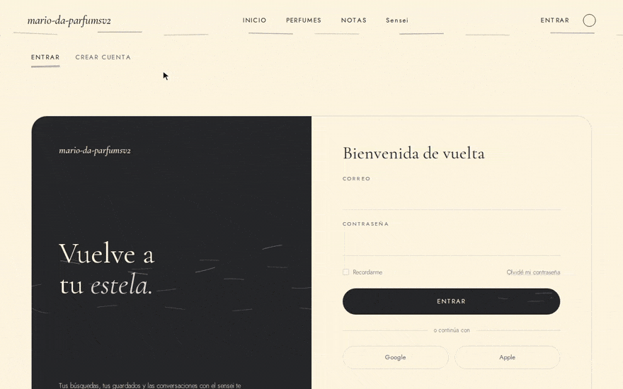

# Mario da Parfums

Comparador de precios de perfumes para Chile, con búsqueda textual, búsqueda semántica y un chatbot que usa herramientas propias de la aplicación. Es un **proyecto de aprendizaje y experimentación técnica**, no un producto en operación.


> **Los precios y las tiendas son simulados.** El proyecto no hace scraping de sitios externos: se decidió simularlo para evitar problemas legales y contractuales con sitios de terceros. Las marcas y nombres de perfumes son reales (dataset de Kaggle); las descripciones, precios y las 5 tiendas (dominios `.example.com`) son inventados. Ver [`docs/requirements.md`](docs/requirements.md).

## Qué hace

| | |
|---|---|
| **Comparador de precios** | Para cada perfume muestra en qué tiendas está y a qué precio (CLP). |
| **Búsqueda textual** | Coincidencias parciales por nombre o marca: `jean` o `gaultier` encuentran Jean Paul Gaultier; `dior sauvage` funciona en cualquier orden. |
| **Búsqueda semántica** | Consultas en lenguaje natural ("perfumes frescos para verano") con embeddings y un índice HNSW. |
| **Chatbot con tools** | Un LLM (Gemini) que consulta el catálogo y la similitud mediante servidores MCP. |
| **Cuentas y favoritos** | Registro, sesión por cookie, roles y perfil con perfumes guardados. |

### Demo

| Comparador | Búsqueda semántica |
|---|---|
|  |  |

| Chatbot con herramientas | Búsqueda textual parcial |
|---|---|
|  |  |

| Sesión y perfil con favoritos |
|---|
|  |

## Arquitectura

```
                 Navegador
        ┌──────────┼───────────┐
        ▼          ▼           ▼
    Frontend   similarityServer  Chatbot (WebSocket)
    Next.js      FastAPI          Gemini + tools
        │        HNSW + embeddings   │ MCP
        ▼              ▲             ▼
     Backend ──────────┘      Backend / similarityServer
     NestJS                    (servidores MCP de solo lectura)
        │
        ▼
    Postgres  ◄── importador de catálogo, priceGenerator (jobs batch)
```

El diagrama completo, la responsabilidad de cada servicio y por qué están separados están en [`docs/architecture.md`](docs/architecture.md).

## Stack

- **Frontend:** Next.js 16, React 19, Tailwind CSS v4.
- **Backend:** NestJS, Drizzle ORM, PostgreSQL 16 (`pg_trgm`), JWT en cookie httpOnly.
- **Búsqueda semántica:** Python, FastAPI, `sentence-transformers` (`paraphrase-multilingual-MiniLM-L12-v2`), `hnswlib`.
- **Chatbot:** TypeScript, WebSocket, Gemini (`@google/genai`), protocolo MCP.
- **Infraestructura:** Docker y Docker Compose (un único `docker-compose.yml`), pnpm workspaces.
- **Calidad:** Vitest y pytest, tests e2e del backend contra Postgres real, mutation testing (Stryker y Cosmic Ray) y specs por feature.

## Inicio rápido

Requisitos: Docker con Compose v2 y unos 4 GB de RAM libres. La imagen del servicio de similitud pesa unos 2 GB.

```bash
cp .env.example .env          # edita JWT_SECRET; GEMINI_API_KEY es opcional (solo el chatbot)
# el dataset de perfumes no está en el repo: ver docs/local-setup.md (Kaggle o copia manual)
docker compose --profile seed up -d --build
```

Cuando todo esté `healthy`, abre <http://localhost:3010>. Un único `.env` en la raíz sirve tanto a Docker como al desarrollo sin Docker. La guía completa (dataset, usuario admin, tests, solución de problemas) está en [`docs/local-setup.md`](docs/local-setup.md).

## Documentación

| Documento | Contenido |
|---|---|
| [`docs/README.md`](docs/README.md) | Índice completo |
| [`docs/requirements.md`](docs/requirements.md) | Alcance real, fuera de alcance y aviso sobre datos simulados |
| [`docs/architecture.md`](docs/architecture.md) | Servicios, puertos y flujos |
| [`docs/design-decisions.md`](docs/design-decisions.md) | Decisiones con alternativas y trade-offs |
| [`docs/features/`](docs/features) | Una página por funcionalidad |
| [`docs/local-setup.md`](docs/local-setup.md) | Instalación local |
| [`docs/production.md`](docs/production.md) | Qué está implementado para operar y qué solo se recomienda |
| [`docs/limitations.md`](docs/limitations.md) | Limitaciones conocidas |
| [`specs/`](specs) | Especificación de cada feature |

## Propósito del proyecto

Se construyó para practicar el recorrido completo de una idea de producto: diseñar una arquitectura de servicios, integrar TypeScript y Python sobre una misma base de datos, incorporar embeddings y un LLM con herramientas, iterar y terminar con un sistema funcional, reproducible y documentado. No pretende ser una innovación algorítmica: el modelo de embeddings es público y preentrenado, el índice viene de una librería estándar y el LLM es de un tercero. Ver [`docs/purpose.md`](docs/purpose.md).

## Proceso de desarrollo con agentes

El proyecto se desarrolló con agentes de código (Claude Code) bajo reglas explícitas del repositorio:

- una **spec por feature** (`specs/<feature>.md`) acordada antes de implementar;
- un **git worktree por feature**, con su propia rama y sesión;
- **sesiones separadas para implementar y para probar**, de modo que quien verifica no sea quien escribió el código;
- `CLAUDE.md` por paquete y *skills* propias (testing, auditoría de seguridad, optimización de consultas);
- revisión humana de las decisiones de arquitectura y del resultado de cada agente.

El agente produce código; la descomposición del problema, las restricciones, la revisión y las decisiones siguen siendo humanas. Detalle en [`docs/agentic-development.md`](docs/agentic-development.md).

## Limitaciones

- Precios, tiendas, tamaños y stock son simulados; no es un comparador real.
- Las descripciones de los perfumes son plantillas: la búsqueda semántica no tiene evaluación de relevancia y refleja poco más que marca, familia y concentración.
- La búsqueda textual no ordena por relevancia ni tolera erratas ni acentos.
- El chatbot depende de Gemini y de su clave; es de solo lectura y su guardrail no es una barrera dura. Sus respuestas pueden tardar entre unos 5 y 40 s, sobre todo por las llamadas secuenciales a la API de Gemini.
- Diseñado y medido a escala de ~1.000 perfumes; no hay scheduler ni infraestructura de producción implementada.

La lista completa y verificada está en [`docs/limitations.md`](docs/limitations.md).

## Licencia

El código se distribuye bajo la licencia MIT (ver [`LICENSE`](LICENSE)). El dataset de perfumes no forma parte del repositorio y tiene su propia licencia (ver más abajo).

## Créditos de datos

El catálogo parte de "Perfume Dataset" de Ayush (`ayushghawana`) en Kaggle, bajo licencia CC BY 4.0: <https://www.kaggle.com/datasets/ayushghawana/perfume-dataset>. Detalle en [`similarityServer/data/README.md`](similarityServer/data/README.md).
